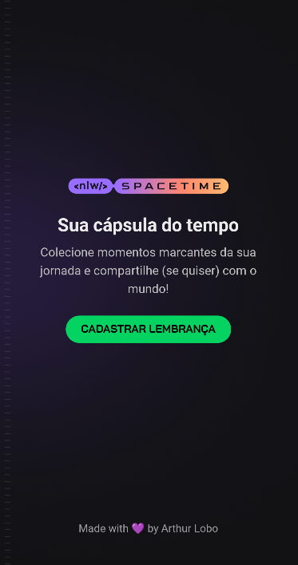

### Hi there! 👋

> A time capsule that allows the user to relive precious moments of their lives.
>
> With this app you can record a memory adding a description and an image for that incredible moment. Inside your account you can access a timeline with all the registered memories.
>
> The objective of this project was to improve my UX and UI skills, the improvement of tools for mobile development such as React Native, Typescript and also user authentication with github's OAuth service.
>
> [Prototype in Figma](https://www.figma.com/file/q2RnMH6iSBp3CWe1DpIo2W/C%C3%A1psula-do-tempo-%E2%80%A2-Trilha-Ignite-(Community)?type=design)

## What is inside?

- [React Native](https://reactnative.dev/)
- [Typescript](https://www.typescriptlang.org/)
- [Expo](https://expo.dev/)
- [Expo-auth](https://docs.expo.dev/guides/authentication/?utm_source=google&utm_medium=cpc&utm_content=performancemax&gclid=CjwKCAjw-IWkBhBTEiwA2exyO2GAF3UGAuRbIXn_EBndb-eZVZUQeQtlBCD-hF3fhtnWpsNIWln_MRoCrDkQAvD_BwE)
- [Expo-imagepicker](https://docs.expo.dev/versions/latest/sdk/imagepicker/?utm_source=google&utm_medium=cpc&utm_content=performancemax&gclid=CjwKCAjw-IWkBhBTEiwA2exyOwUCN9OibNTC3E0tnL5R3Q7-QLtY3B0SBUYabkUKWOb1U0uIcoKpzBoCuXoQAvD_BwE)
- [Expo-router](https://docs.expo.dev/guides/routing-and-navigation/?utm_source=google&utm_medium=cpc&utm_content=performancemax&gclid=CjwKCAjw-IWkBhBTEiwA2exyO7C_-mlQOfMbaP_xnL_c6HnlJkoN85ciwiQ_b8JKSI--wzGbbxqr3RoCJj4QAvD_BwE)
- [NativeWind](https://www.nativewind.dev/)
- [Axios](https://axios-http.com/ptbr/docs/intro)
- [Prettier](https://prettier.io/)

## Getting Started

### Install dependencies:

```bash
pnpm install
```

or

```bash
yarn
```

or

```bash
npm install
```

### Run development server

```bash
expo start
```

## Structure

```
└── app
└── src
    ├── assets
    ├── lib

```

| Folder         | Description                                          |
| ----------     | -------------------------------------------          |
| **app**        | Pages inside application                             |
| **assets**     | Images and static files for application              |
| **lib**        | Configuration of libraries used in the project       |

## 💻 Web version

[Time-capsule Web](https://github.com/arthurlbo/time-capsule/tree/main/web)

## 🚀 Api

[Time-capsule Api](https://github.com/arthurlbo/time-capsule/tree/main/server)

<p align="center">Made with 🤍 by Arthur</p>
