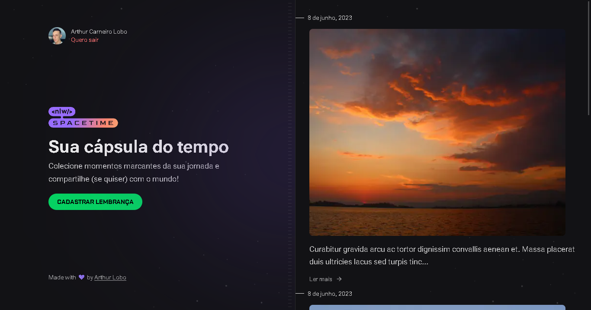

### Hi there! 👋

> A time capsule that allows the user to relive precious moments of their lives.
>
> With this app you can record a memory adding a description and an image for that incredible moment. Inside your account you can access a timeline with all the registered memories.
>
> The objective of this project was to improve my UX and UI skills, the improvement of tools for web development such as Next, React, Tailwind, Typescript and also user authentication with github's OAuth service.
>
> [Prototype in Figma](https://www.figma.com/file/q2RnMH6iSBp3CWe1DpIo2W/C%C3%A1psula-do-tempo-%E2%80%A2-Trilha-Ignite-(Community)?type=design)

## What is inside?

- [NextJS](https://nextjs.org/)
- [ReactJS](https://reactjs.org)
- [TypeScript](https://www.typescriptlang.org)
- [TailwindCSS](https://tailwindcss.com/)
- [Lucide React](https://lucide.dev/)
- [Axios](https://axios-http.com/ptbr/docs/intro)
- [Eslint](https://eslint.org)
- [Prettier](https://prettier.io)
- [js-cookie](https://github.com/js-cookie/js-cookie)
- [jwt-decode](https://www.npmjs.com/package/jwt-decode)

## Getting Started

### Install dependencies:

```bash
pnpm install
```

or

```bash
yarn
```

or

```bash
npm install
```

### Run development server

```bash
pnpm dev
```

or

```bash
yarn dev
```

or

```bash
npm run dev
```

Open [http://localhost:3000](http://localhost:3000) with your browser to see the result.

## Structure

```
└── src
    ├── app 
        ├── api
        ├── memories
    ├── assets
    ├── components
    ├── lib
```

| Folder         | Description                                          |
| ----------     | -------------------------------------------          |
| **app**        | Webapp pages                                         |
| **api**        | Api routes and logic                                 |
| **memories**   | Memories pages                                       |
| **assets**     | Images and static files for application              |
| **components** | Pages components                                     |
| **lib**        | Configuration of libraries used in the project       |

## Commands

- `dev`: run development server
- `build`: creates the production build version
- `lint`: runs the linter in all components and pages


## 📱 Mobile version

[Time-capsule App](https://github.com/arthurlbo/time-capsule/tree/main/mobile)

## 🚀 Api

[Time-capsule Api](https://github.com/arthurlbo/time-capsule/tree/main/server)

<p align="center">Made with 🤍 by Arthur</p>
